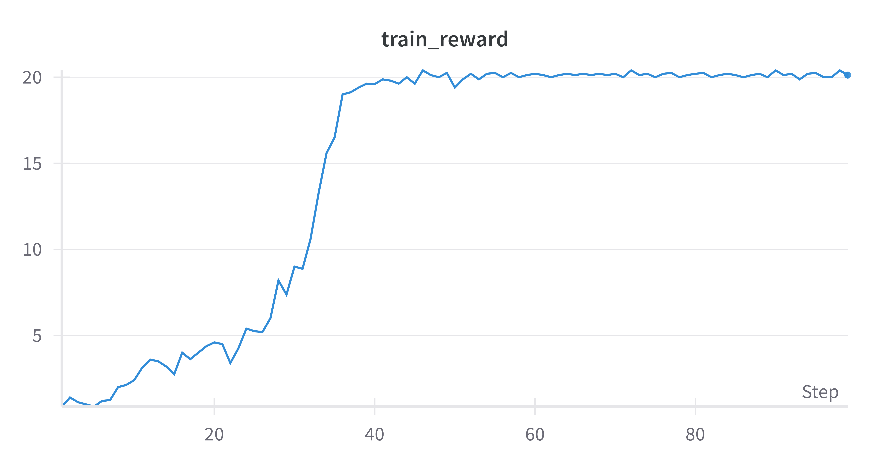
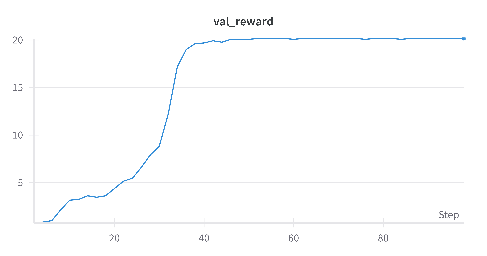

# jRLHF

jRLHF (Reinforcement Learning from Human Feedback) is a Python package designed to train language models using reinforcement learning methods and custom reward modeling. It includes utilities for training reward models, generating datasets, and implementing policy gradient algorithms.

## Features
- **Reward Modeling**: Implement custom reward functions with simple or transformer-based reward models.
- **Reinforcement Learning**: Train policies using vanilla policy gradient (VPG) with support for model-generated rewards.
- **Flexible Configurations**: Modular design for easy customization of training pipelines, including dataset creation and reward computation.
- **Dataset Utilities**: Tools to preprocess and tokenize text for training reward models.

## Installation
Install the package directly from the repository using pip:
```bash
pip install git+https://github.com/jacksonkunde/jRLHF.git
```

or install with `requirements.txt`
```bash
git clone https://github.com/jacksonkunde/jRLHF.git
cd jRLHF
pip install -r requirements.txt
```

## File Structure
```
jRLHF/
├── __init__.py                # Package initialization
├── config.py                  # Configuration classes for training
├── reward_model.py            # Reward model implementation
├── reward_model_trainer.py    # Reward model trainer logic
└── vanilla_policy_gradient.py # Policy Gradient trainer implementation
```

### Key Files and Descriptions

1. **`config.py`**  
   Contains configuration classes for training, such as `RLTrainingConfig`, which extends my trainer class [jTrainer](https://github.com/jacksonkunde/jtransformer/blob/main/jtransformer/trainer.py)

2. **`reward_model.py`**  
   Implements reward models, including:
   - `JrewarderSimple`: A basic reward model that counts occurrences of a specific token.
   - `JrewarderLM`: A transformer-based reward model capable of evaluating sequences and providing scalar rewards.

3. **`reward_model_trainer.py`**  
   Provides the `RewardModelTrainer` class for training reward models. Key features:
   - Supports dataset creation, padding, and token count-based rewards.
   - Configurable optimizer (AdamW) and loss function (MSE).
   - Dataset concatenation and token-based reward computation.

4. **`cookbook/shakespeare/train_reward_model.py`**  
   A standalone script for training reward models. Highlights:
   - Tokenizes input data and splits it into training and validation datasets.
   - Configures and trains a transformer-based reward model using `RewardModelTrainer`.

5. **`vanilla_policy_gradient.py`**  
   Implements a policy gradient trainer (`PolicyGradientTrainer`). Features include:
   - Generates sequences from a language model.
   - Computes rewards using a reward model.
   - Updates the model using policy gradient algorithms.
   - Includes options for variance reduction using a baseline.

### Training a Reward Model
1. Download and preprocess the dataset:
   ```bash
   wget -P cookbook/shakespeare/ https://raw.githubusercontent.com/karpathy/char-rnn/master/data/tinyshakespeare/input.txt
   ```

2. Train the reward model:
   ```bash
   python3 cookbook/shakespeare/train_reward_model.py
   ```
      Alternatively, you can use this [Colab notebook](https://colab.research.google.com/drive/1xwncrPPoyiS7SitdSKI_tliMo2VufimU?usp=sharing) to run the training interactively / on a GPU.


3. Train the original model with the reward model:
   ```bash
   python3 cookbook/shakespeare/train_reward_model.py
   ```
   Alternatively, you can use this [Colab notebook](https://colab.research.google.com/drive/1qRni0lOenbKo0fpmEkWHqNtrPczUE0d0?usp=sharing) to run the training interactively / on a GPU.

🌟 **Visualizing Training and Validation Rewards During RL-Training**

<div style="display: flex; justify-content: space-between;">   </div> 